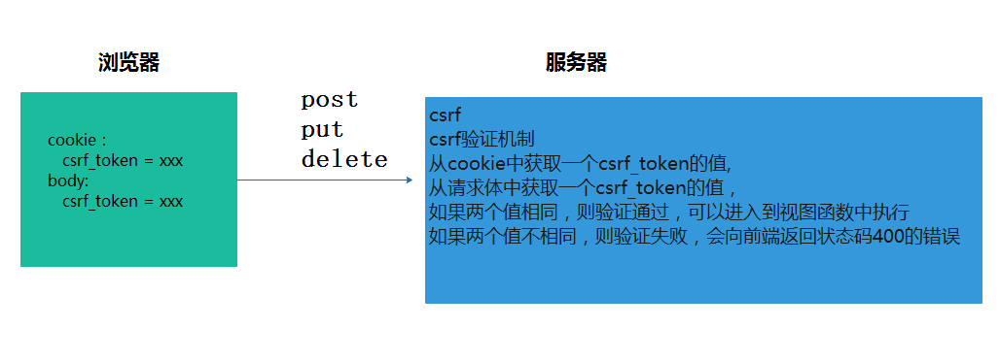
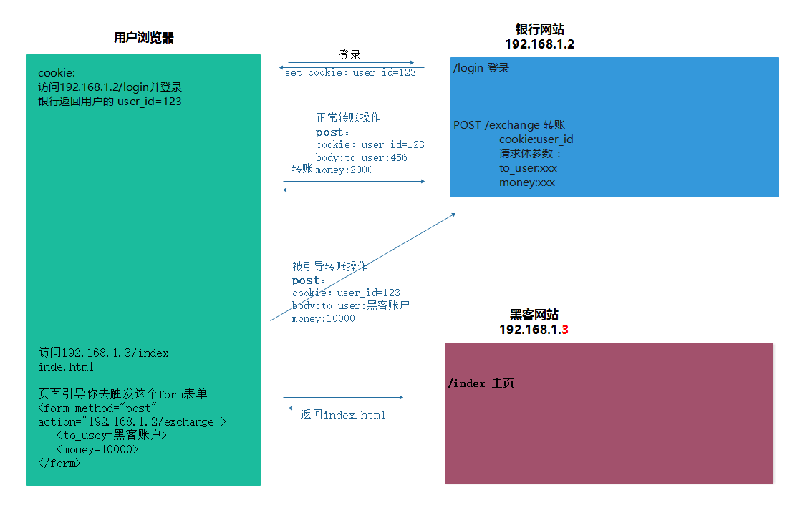
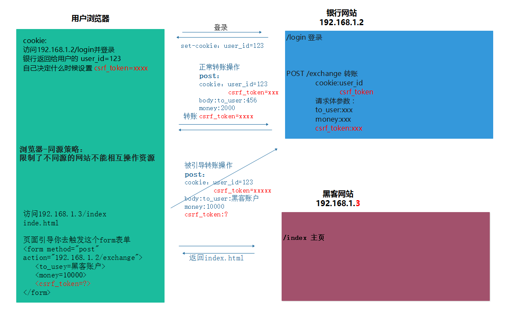

# CSRF防护机制
- CSRF-跨站伪造攻击
- CSRF-验证机制：  
    - 从cookie中获取一个csrf_token的值,从请求体中获取一个csrf_token的值,使用两个值做对比,如果两个值相同,则检验通过,可以进入到试图函数中执行,如果两个值不相同,则验证失败,会向前端返回状态码400的错误
    - 如果请求体的数据不是表单格式,将csrf_token的值可以放到请求头中: X-CSRFToken
    - 
- 发送的请求体中需要包含两个cookie
    - `cookie:csrf_token=xxx`
    - `body:csrf_token=xxx`
- 未开启CSRF防护机制图示：
    - 
- 开启CSRF防护机制图示：
    - 