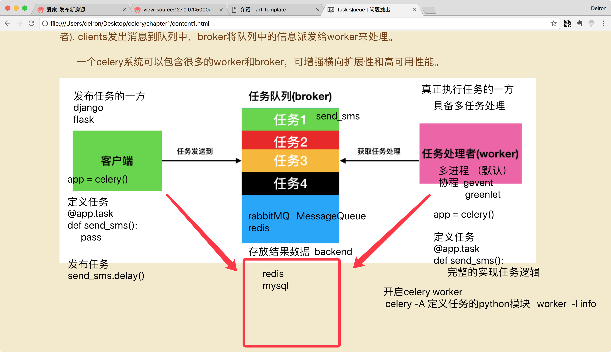

# Celery模型说明
- celery简易模型
    - 客户端(client)
        - 发布任务的一方
    - 任务处理者(worker)
        - 执行任务的一方
        - 具备多任务处理
            - 多进程(默认-进程池)
            - 协程
                - gevent
                - greenlet
    - 任务队列(broker)
        - 中间人
            - rabbitMQ 
                - MessageQueue
            - redis
    - backend(第四方)
        - 存放结果数据
        - 任意存放方式
    - 图示  
    
- celery
    - celery -A ihome.tasks.task_sms worker -l info
    
  