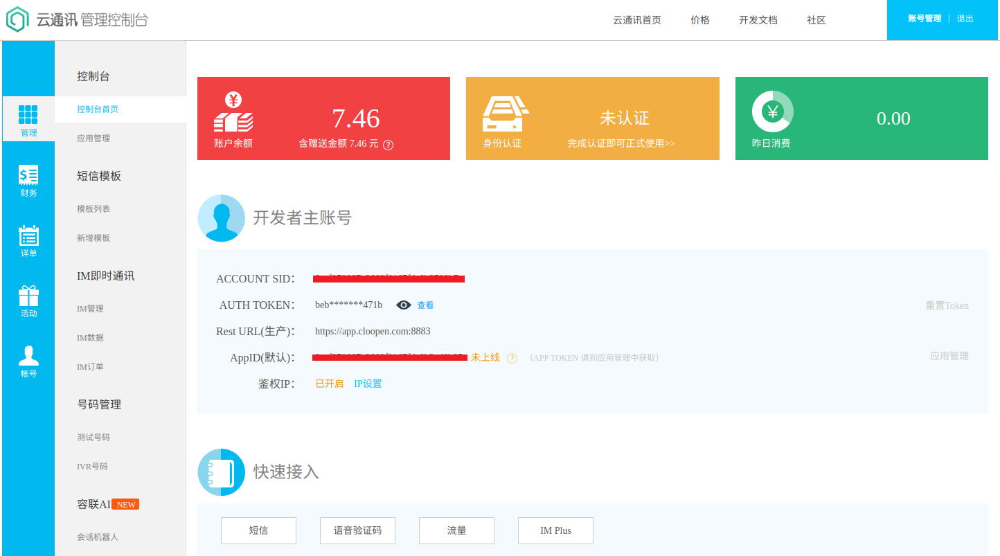
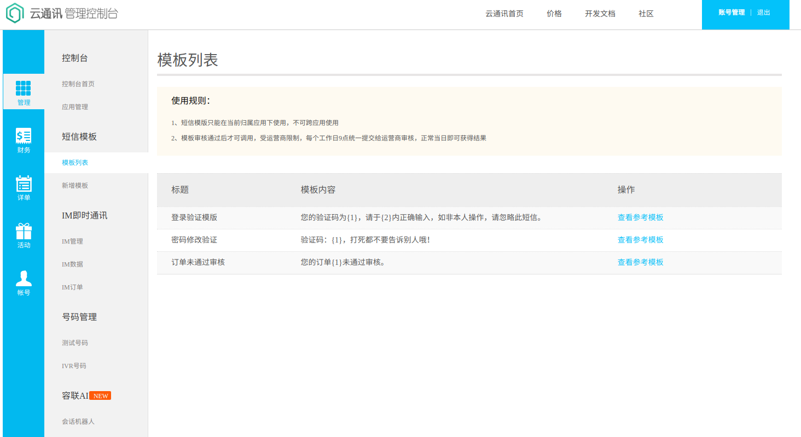
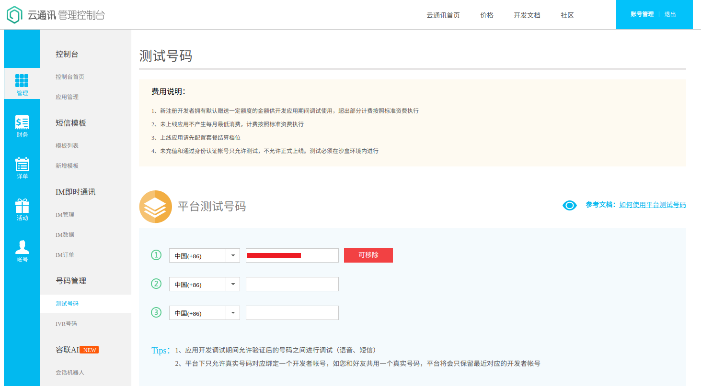
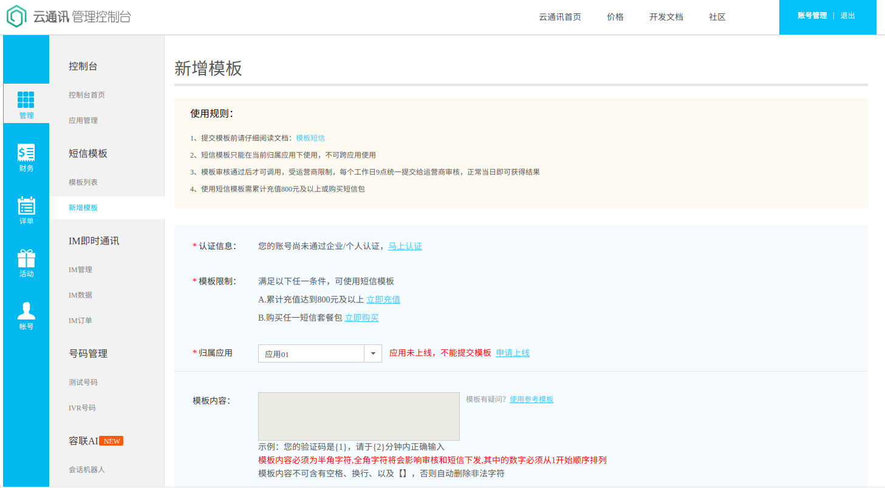

# 短信发送
- [容联云-云通讯](https://www.yuntongxun.com)
- [容联云-开发文档](https://www.yuntongxun.com/doc.html)
- [容联云-python示例](https://doc.yuntongxun.com/p/5a533e9a3b8496dd00dce0b6)
- [容联云-python SDK包](https://pan.baidu.com/s/1SvWHE0Ba31noIEpRZw7RIw)
- 具体流程：
    - 注册-每个用户刚注册的时候容联云都会送8元做测试费用,完全够用了
        - 
    - 发送到用户的短信模板-因为是测试的所以只能使用一个模板
        - 
    - 测试的手机号,只能在这里设置的手机号才能成功收到信息
        - 
    - 创建新的模板需要给钱
        - 