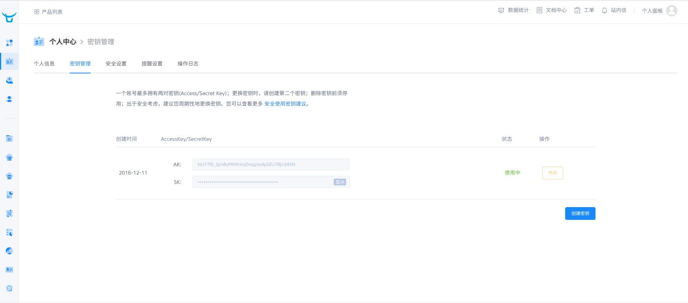
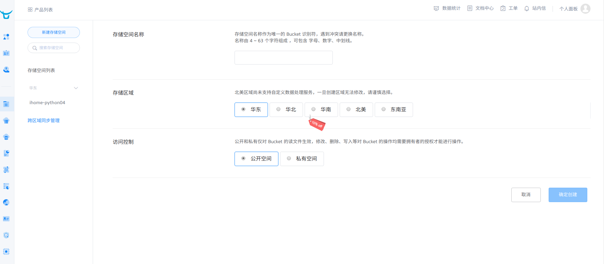
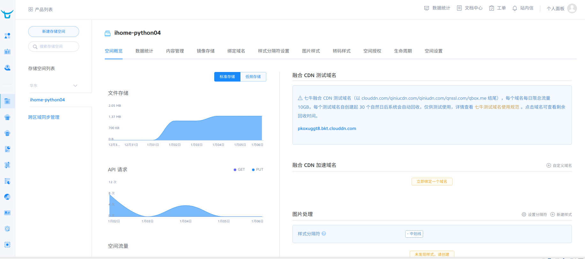

# 七牛上传图片的使用
[七牛云](https://www.qiniu.com/)
- 注册-实名验证
    - 
- 对象存储-新建存储空间
    - 
- 查看存储空间
    - 
- 具体代码 /iHome-python/ihome/utils/image_storrage.py

```python
# -*- coding: utf-8 -*-
# flake8: noqa

from qiniu import Auth, put_data, etag
import qiniu.config

# 需要填写你的 Access Key 和 Secret Key
access_key = ''
secret_key = ''

def storage(file_data):
    """
    上传文件到七牛云
    :param file_data:  要上传的文件数据
    :return:
    """
    # 构建鉴权对象
    q = Auth(access_key, secret_key)

    # 要上传的空间
    bucket_name = 'ihome-python04'

    # 上传到七牛后保存的文件名
    # key = 'my-python-logo.png'

    # 生成上传 Token，可以指定过期时间等
    token = q.upload_token(bucket_name, None, 3600)

    # 要上传文件的本地路径
    # localfile = './sync/bbb.jpg'

    ret, info = put_data(token, None, file_data)

    print(info)
    print("*" * 10)
    print(ret)
    if info.status_code == 200:
        # 表示上传成功, 返回文件名
        return ret.get("key")
    else:
        # 上传失败
        raise Exception("上传七牛失败")


if __name__ == '__main__':
    with open("./git.jpg", "rb") as f:
        file_data = f.read()
        storage(file_data)

```
