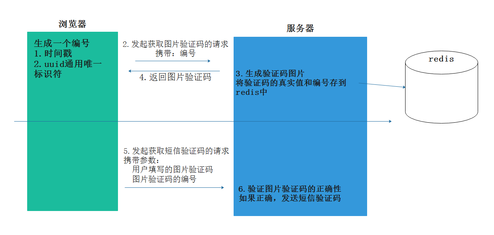

# 图片验证流程图
- 图示
    - 
- 逻辑代码-地址：ihome/api_1_0/verify_code.py
    ```python
    # coding:utf-8

    from . import api
    from ihome.utils.captcha.captcha import captcha
    from ihome import redis_store, constants
    from flask import current_app, jsonify, make_response
    from ihome.utils.response_code import RET
    
    # GET 127.0.0.1/api/v1.0/image_codes/<image_code_id>
    
    @api.route("/image_code/<image_code_id>")
    def get_image_code(image_code_id):
    """
    获取图片验证码
    :param image_code_id: 图片验证码编号
    :return:  正常：验证码图片  异常:返回json
    """
    # 业务逻辑处理
    # 生成验证码图片
    # 名字  真实文本  图片数据
    name, text, image_data = captcha.generate_captcha()

    # 将验证码真实值与编号保存到redis中, 设置有效期
    # redis: 字符串 列表 哈希 set zet
    # "key": xxx
    # 使用哈希维护有效期的时候只能整体设置
    # "image_codes" : {"编号1": "真实文本", "编号2": "真实文本"}
    # 哈希 hset("image_codes", "id1", "abc")
    # 哈希 hget("image_codes", "id1")

    # 单条维护记录,选用字符串
    # "image_code_编号1:": "真实值"
    # "image_code_编号2:": "真实值"

    # redis_store.set("image_code_%s" % image_code_id, text)
    # redis_store.expire("image_code_%s" % image_code_id, constants.IMAGE_CODE_REDIS_EXPIRES)
    #                       记录名字                    有效期                              真实文本
    try:
        redis_store.setex("image_code_%s" % image_code_id, constants.IMAGE_CODE_REDIS_EXPIRES, text)
    except Exception as e:
        # 记录日志
        current_app.logger.error(e)
        return jsonify(error=RET.DBERR, errmag="保存图片验证码信息失败")
    
    # 返回图片
    resp = make_response(image_data)
    resp.headers["Content-Type"] = "image/jpg"
    return resp
    ```